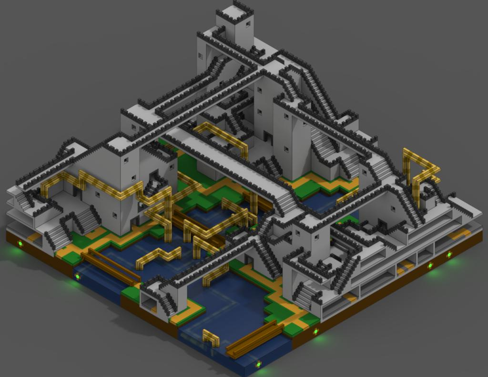
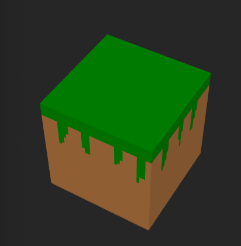
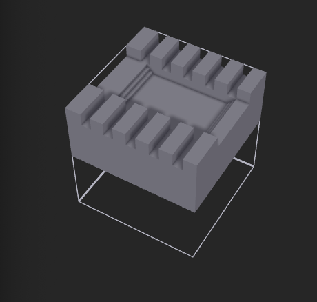
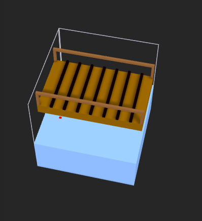
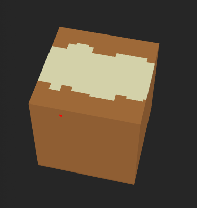
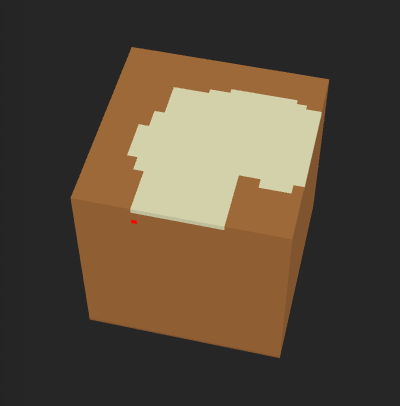
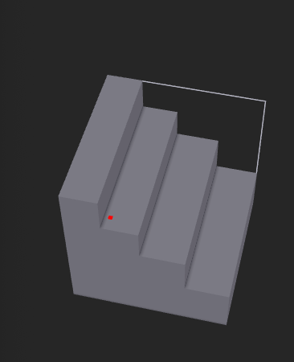

  

> The “wave function collapse”(WFC) algorithm builds a grid of pre-defined tiles ensuring that the tiles properly connect to their neighbours, for example a road tile must neighbour another road tile following the same direction or an intersection tile. In this project we will use the WFC algorithm to produce random 3D voxel maps, like the one below.

The WFC algorithm takes in an archetypical input, and produces procedurally-generated outputs that look like it (overlapping generation). It can also take a set of tiles and constraints, and generate an image using these tiles that match these contraints (tiled generation).
It is most commonly used to create images, but is also capable of building towns in higher dimensions.

# Goals and Deliverables
***
WFC algorithm is used in multiples implementations, the main concept of the algorithm is quite straightforward but a lot of optimization and variations can be done. During this project, we will focus on three things:

- **Build a 3D simple tiled engine**: Take a set of voxels (File format to process voxels, cf MagicaVoxel) and a set of neighbourhood rules to produce a 3D scene that match the constraints rules. We will first produce .vox files to check that our implementation is correct and then render the model using openGL.
- **Design voxels :** Build a set of voxels (.vox file) that can be use to design a meaningful world.
- **Design meaningful rules :** Write rules for the set of voxel created that can lead to a relevant scene generation with the WFC algorithm.

## Optionnal Extensions
In order to improve our resulting scenes we will add some extensions to the project, depending on how much time we have. The potential extensions are describe below: 

- **Animate the parts entering the scene :**
The algorithm as described before only render the final result of the WFC algorithm. We could display instead, each Voxel choose by the algorithm one by one with a nice animation to produce a step by step video of the generation.

- **Bézier curves for camera trajectory :**
It could be nice to allow the user to move the camera nicely in the produced scene using Bezier curve

- **Bloom + emissive lights in the scene :**
To produce a more realistic scene, we could add Bloom and emissive light to the rendering pipeline.

- **Screen space reflections : **
Another extension to make the scene more realistic, add reflection on objects. 

- **Ambient occlusion : **
 Ambient occlusion is a shading and rendering technique used to calculate how exposed each point in a scene is to ambient lighting. For example, the interior of a tube is typically more occluded (and hence darker) than the exposed outer surfaces, and the deeper you go inside the tube, the more occluded (and darker) the lighting become.

- **Infinite world generation :**
Once the user can move the camera in the scene, it could be interesting to infinitely generate scene when the user move further away.

# Schedule
***

You can find in the array below some important dates during the project development:

| Event                            |  Due Date              |
|----------------------------------|-----------------------:|
| Proposal due                     | Thursday April 11, 1pm |
| Proposal feedback by             | Thursday April 18      |
| Project work begins              | Friday April 19        |
| Learn about WFC and report       | Thursday April 25th    |
| Design voxels model to feed WFC  | Thursday May 2nd       |
| Working 3D tiled model           | Thursday May 16        |
| Milestone report due             | Thursday May 16, 1pm   |
| Working rules for the model      | Thursday May 23        |
| Animate parts entering the scene | Thursday May 23        |
| Bezier for camera trajectory     | Tuesday May 28         |
| Final presentation video due     | Tuesday May 28, 1pm    |
| Final report webpage due         | Friday May 31, 1pm     |

# Milestone Update
***
### Where we are right now
We first struggle to establish a correct grading contract for this project, once we did (last week), we started to implement the WFC algorithm in C++ based on the mxgmn C# implementation provided. We had a lot of issues with that but we finally succeed to have a working algorithm. Howether we didn't had time to properly test it for now, since we didn't have meaningfull rules. We also design some voxels with magicaVoxel to feed the algorithm. In parallal we start to implement the rendering pipeline, based on the SolarSystem homework provided in class, we can't render vox file yet but it is in process.

### Preliminary Results
For now we don't have any scene to show since we didn't manage to write meaningfull rules but we designed the parts of the final model, some of them are shown below:

{ width=200 height=200 } {width=200 height=200} {width=200 height=200 }

{ width=200 height=200 } { width=200 height=200 } { width=200 height=200 }

### Updated Schedule
The schedule remain approximatively the same as before, we just added a new event, we need to finish the rules and the WFC algorithm for next week.

# Resources and technologies used
***

## Technologies
- C++
- A 3D rendering engine (OpenGL via LWJGL)
- MagicaVoxel

## Resources :
- https://github.com/mxgmn/WaveFunctionCollapse (C# algorithm implementation and description)
- https://robertheaton.com/2018/12/17/wavefunction-collapse-algorithm/ (base article for the algorithm)
- https://marian42.de/article/wfc/ (algorithm exploitation in 3D)
- https://github.com/ephtracy/voxel-model/blob/master/MagicaVoxel-file-format-vox.txt (for the vox file format)

 We will use the homework SolarSystem base project in C++ to help us integrate OpenGl.
