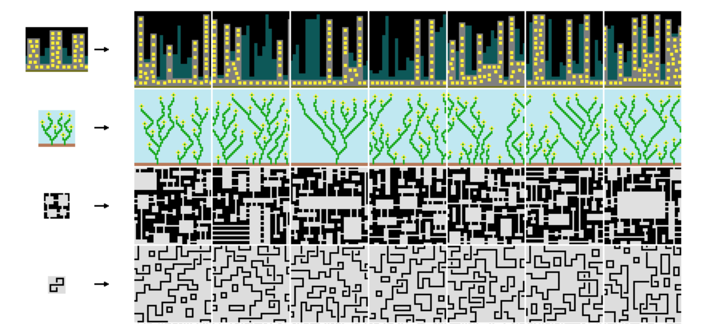

  

> The “wave function collapse”(WFC) algorithm builds a grid of pre-defined tiles ensuring that the tiles properly connect to their neighbours, for example a road tile must neighbour another road tile following the same direction or an intersection tile. In this project we will use the WFC algorithm to produce random 2D and 3D voxel maps, like the one below.

# Goals and Deliverables
***
The WFC algorithm takes in an archetypical input, and produces procedurally-generated outputs that look like it (overlapping generation). It can also take a set of tiles and constraints, and generate an image using these tiles that match these contraints (tiled generation).
It is most commonly used to create images, but is also capable of building towns in higher dimensions.
 

 
WFC algorithm is used in multiples implementations, the main concept of the algorithm is quite straightforward but a lot of optimization and variations can be done. During this project, we will focus on three things:
- Build an overlapping engine for 2D images (takes an image, generates images that look like it)
- Build a tiled engine for 2D images (takes sprites and constraints, generates images using them)
- Build a tiled engine for 3D images (takes 3D-sprites and constraints, generates images using them)
The main goal is to be able to generate various labyrinths with increasing levels of difficulty (affecting the number of possible entries for instance) and a single way out.

## Overlapping Engine

This first part of the project will take, as an input, an image, as well as some parameters, and output a new image that has been generated by applying the WFC algorithm.
In this part, we will only work in 2 dimensions. This part will allow us to build a first implementation of the WFC algorithm and understand it well, to be able to build the next steps of the project. The main idea is to build a labyrinth with the WFC and allow user to choose different parameters to adapt the difficulty.

## Tiled Engine

The second part of the project will take a set of tiles and constraints regarding how tiles can be placed, and will output either an image (if we work in 2 dimensions) or a voxel image (if we work in 3 dimensions).
We will first focus on the 2D implementation, that should be quite straightforward and easy to implement once the Overlapping Engine is done.
Then, we will try to apply the same concept to the 3D space. The algorithm will probably take way longer to run, and might have an higher failure rate (the WFC algorithm doesn't always return successfully -- sometimes it can't generate an image). From then we'll work towards generating solvable labyrinths in 3D.

# Optionnal Extensions

## Step by step generation

The algorithm as described before only outputs a single PNG file, the generated image. It would be nice to be able to generate short videos (GIF or similar) showing each step of the algorithm.

For 3D-generation, we could output directly video files.

## In place 3D images generation

Using a graphics library (OpenGL, wrapped in LWJGL), we would like to be able to render our newly generated labyrinth in 3 dimensions.
We could also think about an interactive app in which the user could move around the generated voxel structure (instead of a fixed point of view image).

## Optimisations

The WFC algorithm can be very time consuming when handling big large output's images. We could investigate the performance optimizations to make the algorithm faster. For example, there’s no need to recalculate every square’s entropy on every iteration, and information propagation throughout the wavefunction can be made substantially faster.

##  Ambient occlusion
Once the 3D labyrinth generated and rendered in 3D, we will add ambient occlusion to make it more realistic.

# Schedule
***

You can find in the array below some important dates during the project development:

| Event                        |  Due Date              |
|------------------------------|-----------------------:|
| Proposal due                 | Thursday April 11, 1pm |
| Proposal feedback by         | Thursday April 18      |
| Project work begins          | Friday April 19        |
| Working 2D overlapping model | Thursday April 25th    |
| Working 2D tiled model       | Thursday May 2nd       |
| Working 3D tiled model       | Thursday May 16        |
| Milestone report due         | Thursday May 16, 1pm   |
| Step-by-step videos          | Thursday May 23        |
| In-place 3D generation       | Tuesday May 28         |
| Final presentation video due | Tuesday May 28, 1pm    |
| Final report webpage due     | Friday May 31, 1pm     |

Some parts can be developped in parallel, in particular the optimization / step-by-step video can be developped before the 3D-model is finished, and the in-place 3D generation can be developped in parallel with these two other optional features.

# Resources and technologies used
***

## Technologies
- C++
- A 3D rendering engine (OpenGL via LWJGL)

## Resources :
- https://github.com/mxgmn/WaveFunctionCollapse (C# algorithm implementation and description)
- https://robertheaton.com/2018/12/17/wavefunction-collapse-algorithm/ (base article for the algorithm)
- https://marian42.de/article/wfc/ (algorithm exploitation in 3D)
- https://github.com/ephtracy/voxel-model/blob/master/MagicaVoxel-file-format-vox.txt (for the vox file format)

A C## implementation of the WFC algorithm is mentioned on the project homepage, but as our goal is to implement the algorithm by ourselves, we won't use it in our project. We will however use the homework SolarSystem base project in C++ to help us integrate OpenGl.
