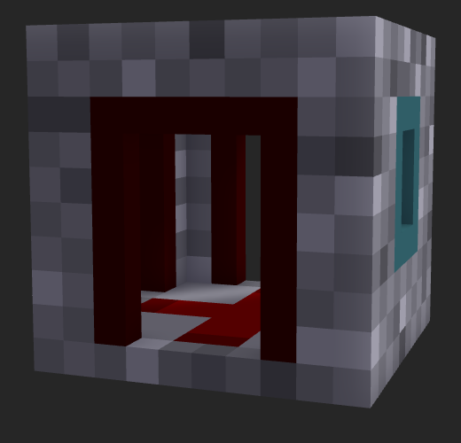
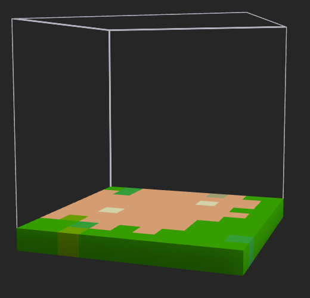
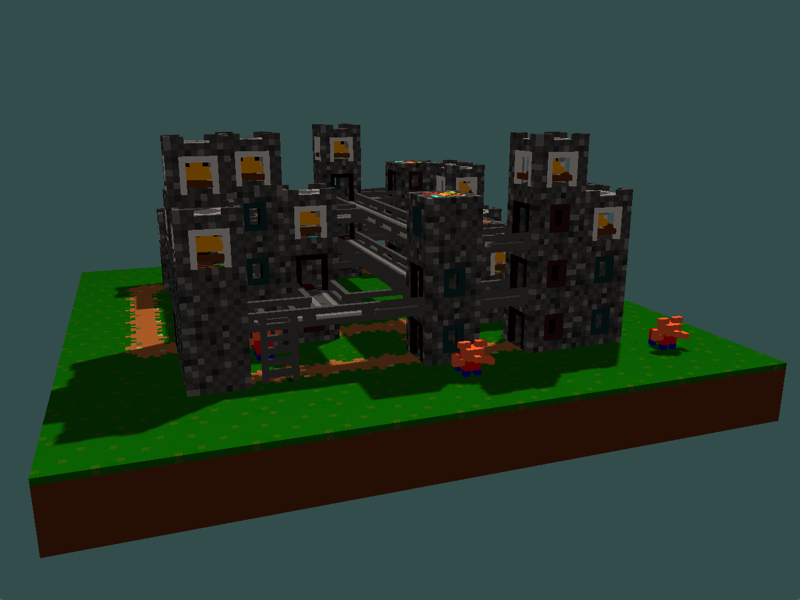
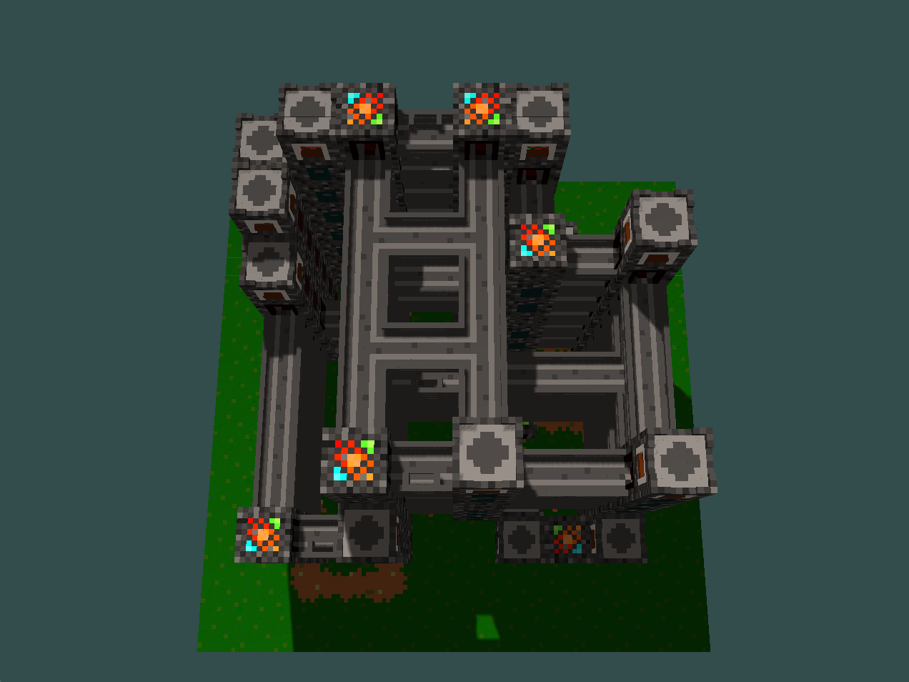

  

> The “wave function collapse” (WFC) algorithm builds a grid of pre-defined tiles ensuring that the tiles properly connect to their neighbours, for example a road tile must neighbour another road tile following the same direction or an intersection tile. In this project we will use the WFC algorithm to produce random 3D voxel maps, like the one below (here rendered using MagicaVoxel).

The WFC algorithm takes in an archetypical input, and produces procedurally-generated outputs that look like it (overlapping generation). It can also take a set of tiles and constraints, and generate an image using these tiles that match these contraints (tiled generation).
It is most commonly used to create images, but is also capable of building towns in higher dimensions.

# Goals and Deliverables
***
WFC algorithm is used in multiples implementations, the main concept of the algorithm is quite straightforward but a lot of optimization and variations can be done. During this project, we will focus on three things:

- **Build a 3D simple tiled engine**: Take a set of voxels (File format to process voxels, cf MagicaVoxel) and a set of neighbourhood rules to produce a 3D scene that match the constraints rules. We will first produce .vox files to check that our implementation is correct and then render the model using openGL.
- **Design voxels :** Build a set of voxels (.vox file) that can be use to design a meaningful world.
- **Design meaningful rules :** Write rules for the set of voxel created that can lead to a relevant scene generation with the WFC algorithm.

### Optionnal Extensions
In order to improve our resulting scenes we will add some extensions to the project, depending on how much time we have. The potential extensions are describe below: 

- **Animate the parts entering the scene :**
The algorithm as described before only render the final result of the WFC algorithm. We could display instead, each Voxel choose by the algorithm one by one with a nice animation to produce a step by step video of the generation.

- **Bézier curves for camera trajectory :**
It could be nice to allow the user to move the camera nicely in the produced scene using Bezier curve

- **Bloom + emissive lights in the scene :**
To produce a more realistic scene, we could add Bloom and emissive light to the rendering pipeline.

- **Screen space reflections : **
Another extension to make the scene more realistic, add reflection on objects. 

- **Ambient occlusion : **
 Ambient occlusion is a shading and rendering technique used to calculate how exposed each point in a scene is to ambient lighting. For example, the interior of a tube is typically more occluded (and hence darker) than the exposed outer surfaces, and the deeper you go inside the tube, the more occluded (and darker) the lighting become.

- **Infinite world generation :**
Once the user can move the camera in the scene, it could be interesting to infinitely generate scene when the user move further away.

# Schedule
***

You can find in the array below some important dates during the project development:

| Event                            |  Due Date              |
|----------------------------------|-----------------------:|
| Proposal due                     | Thursday April 11, 1pm |
| Proposal feedback by             | Thursday April 18      |
| Project work begins              | Friday April 19        |
| Learn about WFC and report       | Thursday April 25th    |
| Design voxels model to feed WFC  | Thursday May 2nd       |
| Working 3D tiled model           | Thursday May 16        |
| Milestone report due             | Thursday May 16, 1pm   |
| Working rules for the model      | Thursday May 23        |
| Animate parts entering the scene | Thursday May 23        |
| Bezier for camera trajectory     | Tuesday May 28         |
| Final presentation video due     | Tuesday May 28, 1pm    |
| Final report webpage due         | Friday May 31, 1pm     |

# Technical Approach
***
### WFC algorithm implementation
We first adapted the C# implementation of WFC by mxgmn in C++, we struggled a bit with the data structures and the voxel format at the beginning but everything eventually worked out. We used the same structure as mxgmn, xml configuration files indicate the parameters, the rules and the source blocks of the algorithm and we define for each block a symmetry component to facilitate voxels rotations. (https://www.dropbox.com/s/zeiat1w8zre9ro8/Knots%20breakdown.png?dl=0)

### Voxels design and Rules implementation
We first began to build a set of voxels block to feed our algorithm. This step was quite time consuming since we needed to think about how each block will interact with each other. We built a set of 16 different blocks to define the world, some of which are shown below:

{ width=200 height=200 } {width=200 height=200} {width=200 height=200 }

{ width=200 height=200 } { width=200 height=200 } { width=200 height=200 }

Once we had our different pieces of the puzzle, we needed to write down rules to define which block can be placed next to each other taking in account the rotation and the symmetry of each piece.
One of the main problems that occurred during the development was the low percentage of success rate. Indeed the more complex the rules/constraints are, the less likely it is for the algorithm to find a stable configuration.
Currently, there are about 200 rules with a success rate of about 4% to obtain the models shown in the results part. However, the current rules enables for complex structure generation (Bridge-connected high buildings, doors, balconies, roads, stairs...). The rules are located in the same folder as blocks : /World/data.xml and /World2/data.xml.

### Rendering the scene
We started with the SolarSystemViewer homework source code as a foundation for our rendering engine. At first, we had an object for each voxe, but the loop rendering the voxels had to render more than 200'000 voxels, and as it runs on the CPU it was not efficient at all. We therefore decided to have a single object with all the voxels direcly mapped in it, and it greatly improved performance. Phong lighting and shadows (with a shadow map) were implemented with shaders.

We also allow the user to move around in the scene, using the standard WASD keys (+ Q to go down, and E to go up), and to look around him, using the arrow keys. Additionnal keys allow him to control time: SPACE will stop it, F will slow it, and R will accelerate it. Finally, ENTER will render the full scene immediately (instead of step-by-step), and B will enable or disable the automatic camera path, following Bezier curves.

Files related to rendering are located under /src/rendering/.

### Bezier Curve and camera trajectory
Four points are computed in the scene, respectively in the corners of the tilemap in order to create an ellipse bezier curve. The camera then follows the path of the curve, looking at center of the tilemap.  

### Animate the parts entering the scene
We spawn the parts in blocks, and let the gravity do the rest. The challenge in this was to move the blocks directly in the vertex buffer, since as mentioned before there is only one vertex buffer for all the voxels. It was actually quite easy once figured out. All the blocks are added in the VBO but not rendered. We increase the number of blocks to render once we want a block to spawn. And, finally, we update the coordinates in the VBO each time needed. The VBO is registered as a STREAM, to tell OpenGL that it content will be updated a lot.

# Results
***
### Simple Tiled Model Generation (MagicaVoxel render)
{ width=300 height=300 } { width=300 height=300 }
{ width=300 height=300 } { width=300 height=300 }

### Step by Step Animation 
<video width="640" height="480" loop autoplay muted>
  <source src="images/step_by_step_web.mp4" type="video/mp4">
</video>

### Camera following a Bezier Curve
<video width="640" height="480" loop autoplay muted>
  <source src="images/Bezier_web.mp4" type="video/mp4">
</video>
# Resources and technologies used
***

## Technologies
- C++
- OpenGL

## Resources :
- https://github.com/mxgmn/WaveFunctionCollapse (C# algorithm implementation and description)
- https://robertheaton.com/2018/12/17/wavefunction-collapse-algorithm/ (base article for the algorithm)
- https://marian42.de/article/wfc/ (algorithm exploitation in 3D)
- https://github.com/ephtracy/voxel-model/blob/master/MagicaVoxel-file-format-vox.txt (for the vox file format)
- https://bitbucket.org/mxgmn/basic3dwfc/src/master/ (C# implementation)
- https://www.dropbox.com/s/zeiat1w8zre9ro8/Knots%20breakdown.png?dl=0 (How to design meaningful tile rules)